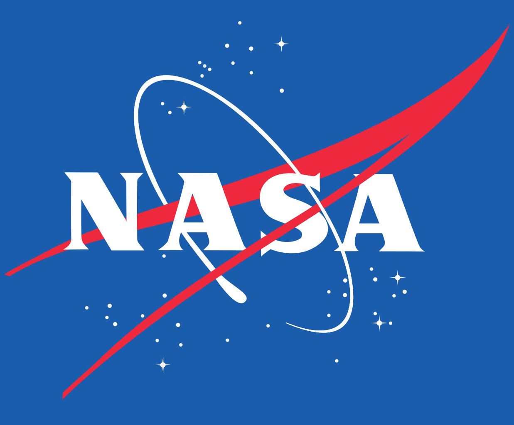

APOD
====

  

This bot will post the astronomy picture of the day from https://apod.nasa.gov with explanations as the message's text.  
For it to work, you'll need an API key that you can get from [here](https://api.nasa.gov/). Put it as value of `apod_api_key` in the `memory.json` file.

You also need to specify the `group_id` where the bot is going to post (and eventually a `parent_id` if you want it's messages to be children of another message).  
`last_posted` is used internally to avoid duplicates.

The APOD bot was tested with Zusam 0.4.5
